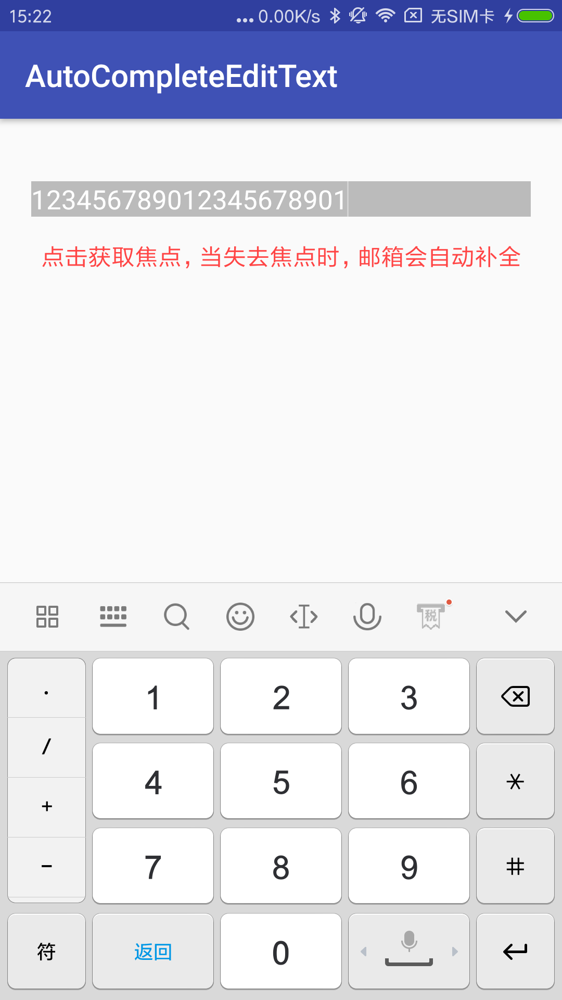
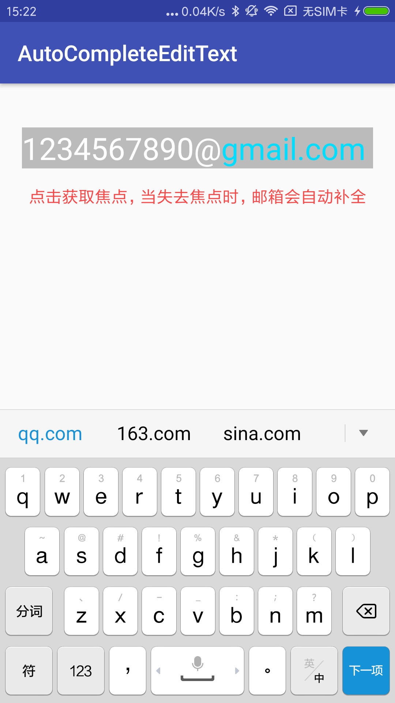

# AutoCompleteEditText
自动补全邮箱EditText，<br/>
* 内容太长时缩小字体
* 自动匹配设置的相应邮箱
* 失去焦点时，自动将相应提醒填充

### 效果图
<center class="half">
    
</center>

```
    // 在Build.gradle文件添加依赖
    implementation 'com.kevintu:autocompleteedittext:1.0.0'


    // 布局文件中使用
        <com.kevin.autocompleteedittext.widget.AutoCompleteEditText
            android:id="@+id/email"
            android:layout_width="match_parent"
            android:layout_height="wrap_content"
            android:layout_marginLeft="20dp"
            android:layout_marginRight="20dp"
            android:layout_marginTop="40dp"
            android:background="#40000000"
            android:clickable="true"
            android:focusable="true"
            android:focusableInTouchMode="true"
            android:hint="请输入内容"
            android:inputType="textEmailAddress"
            android:singleLine="true"
            android:textColor="@android:color/white"
            android:textCursorDrawable="@null"
            android:textSize="28sp"/>


    // 具体看使用方法看实例

```
